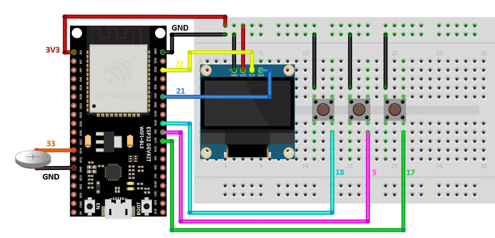

# Electronics

This section provides details about the electronics used in the project.

Below is the schematic of the circuit used:

{:style="width:100%;max-width:800px;"}

The schematic shows the connections between the different components:

- **Power connections:**
  - GND and 3V3 are connected to the breadboard's rails.

- **Buttons:**
  - Three buttons are used, each connected to GND with the following GPIO pins:
    - **GPIO18**: scroll through the battery selection menu ( and send the measurement over MQTT when a battery was already selected )
    - **GPIO5**: go back to the battery selection menu
    - **GPIO17**: select the battery type

- **OLED screen:**
  - GND → **GND**
  - 3V3 → **3V3**
  - SCK → **GPIO22**
  - SDA → **GPIO21**

- **Battery probe:**
  - **GPIO14**: ADC connection to the positive terminal of the battery.
  - **GND**: Negative terminal of the battery.

### Summary of connections:

| Component           | Pin/Connection        | GPIO Pin         |
|---------------------|-----------------------|------------------|
| **Buttons**         | GND                   | GPIO18, GPIO5, GPIO17 |
| **OLED Screen**     | GND                   | GND              |
|                     | 3V3                   | 3V3              |
|                     | SCK                   | GPIO22           |
|                     | SDA                   | GPIO21           |
| **Battery Probe**   | Positive Terminal     | GPIO14 (ADC)     |
|                     | Negative Terminal     | GND              |

