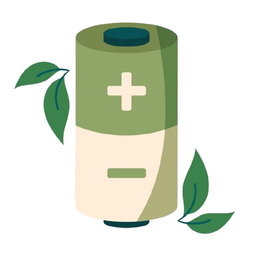

# Battery**Wise**

Welcome to our sustainable project within the course **Engineering & Sustainability**. In this project, we've developed a simple and easy-to-recreate batterytester. Our focus lies in raising awareness for battery disposal, to reduce as much electronic waste as possible.

  

    

  

    
On this site, you can find a step-by-step tutorial to make your own ESP32-based batterytester.

    <ol>
      <li><a href="materials.md">Materials</a></li>
      <li><a href="electronics.md">Electronics</a></li>
      <li><a href="software.md">Software</a></li>
      <li><a href="site.md">Site</a></li>
    </ol>

    

      <a href="https://github.com/BatteryWise/batterywise/tree/main" target="_blank">This</a> is a link to our GitHub repo.
    

    <h3>Team members:</h3>
    <ul>
      <li><strong>Beau Forrez</strong></li>
      <li><strong>Tano Pannekoucke</strong></li>
      <li><strong>Elias Neels</strong></li>
      <li><strong>Thibaut Beck</strong></li>
    </ul>
  

  

    
  

